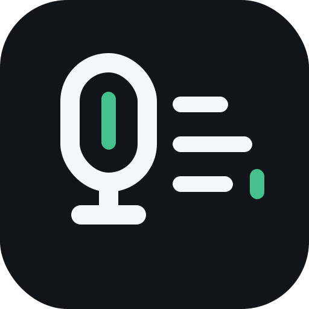

# OpenVoiceIME

<p align="center">
  
</p>

OpenVoiceIME is an Android voice input method editor (IME) that records speech locally, sends the audio to an OpenAI-compatible transcription endpoint, and inserts the returned text into the focused app.

It is meant for people who want a configurable voice keyboard instead of a fixed vendor keyboard, and for developers who want a small Android IME codebase to extend with other speech-to-text providers.

## Related Project

[Postable ASR](https://github.com/ImAngelParraga/postable-asr) is a self-hosted OpenAI-compatible transcription server. OpenVoiceIME can use it as a custom provider by setting the server base URL, token, model, and language in settings.

## Who this is for

- **Android users** who want voice typing through OpenAI, Groq, or a compatible self-hosted transcription server.
- **Self-hosters** who already expose an OpenAI-compatible `/v1/audio/transcriptions` endpoint.
- **Android developers** who want to add provider adapters, improve IME behavior, or use this as a reference for remote speech-to-text input.

## Current status

OpenVoiceIME is early project software. It supports manual installation, configuration, and testing through GitHub Releases or local builds.

Supported today:

- Android IME service for recording, uploading, and inserting transcribed text.
- Settings screen for provider URL, model, token, language, custom presets, and insertion behavior.
- OpenAI-compatible multipart transcription requests.
- Built-in presets for OpenAI and Groq.
- Local response-time metrics and basic network diagnostics.

Not supported yet:

- Provider-specific adapters for Deepgram, AssemblyAI, Google Speech-to-Text, or Azure Speech.
- End-to-end Android instrumented tests.

## How it works

1. The OpenVoiceIME keyboard starts a local microphone recording.
2. The recording is sent as multipart audio to `{baseUrl}/v1/audio/transcriptions`.
3. The configured provider returns a JSON response with a `text` field.
4. OpenVoiceIME commits the text into the active input field.

By default, OpenVoiceIME uses `https://api.openai.com` with `gpt-4o-transcribe`. Groq and custom OpenAI-compatible servers can be selected in settings.

## Setup

1. Download an APK from GitHub Releases, or build one locally.
2. Open **OpenVoiceIME** from the launcher.
3. Grant microphone permission.
4. Choose a provider preset or configure a custom OpenAI-compatible server.
5. Enter an API token and model.
6. Tap the server test button to verify connectivity.
7. Open Android keyboard settings and enable **OpenVoiceIME**.
8. Switch to OpenVoiceIME from the keyboard picker when you want to dictate.

## Build

Run commands from the repository root.

```powershell
.\gradlew.bat testDebugUnitTest assembleRelease
```

The release APK is written to:

```text
app/build/outputs/apk/release/OpenVoiceIME-release.apk
```

Install it on a connected device or emulator with:

```powershell
adb install -r app/build/outputs/apk/release/OpenVoiceIME-release.apk
```

For local debug builds, use:

```powershell
.\gradlew.bat assembleDebug
```

On macOS/Linux, use:

```bash
./gradlew testDebugUnitTest assembleRelease
```

## Releases

Public APKs are distributed through GitHub Releases. Each release should include:

- `OpenVoiceIME-release.apk`
- A short changelog.
- Any known setup or compatibility notes.

Release builds block cleartext HTTP and disable app backup to protect provider credentials. Debug builds allow cleartext HTTP for local development endpoints.

## Transcription compatibility

OpenVoiceIME currently has one OpenAI-compatible transcription client. Providers with different upload flows, authentication schemes, or response formats need separate adapters.

| Service | Status | Base URL | Default model |
| --- | --- | --- | --- |
| OpenAI | Supported default | `https://api.openai.com` | `gpt-4o-transcribe` |
| Groq | Supported | `https://api.groq.com/openai` | `whisper-large-v3-turbo` |
| Custom OpenAI-compatible server | Supported as saved custom preset | User-provided | User-provided |
| Deepgram | Needs adapter | Different endpoint/auth/response | N/A |
| AssemblyAI | Needs adapter | Upload + async polling flow | N/A |
| Google Speech-to-Text | Needs adapter | Google recognizer JSON/OAuth flow | N/A |
| Azure Speech | Needs adapter | Azure speech REST path/auth/body | N/A |

Expected compatible request shape:

```http
POST {baseUrl}/v1/audio/transcriptions
Authorization: Bearer <token>
Content-Type: multipart/form-data
```

Multipart fields:

- `file`: recorded audio
- `model`: configured transcription model
- `language`: optional language code
- `temperature`: `0.0`

Expected success response:

```json
{
  "text": "Transcribed text"
}
```

## Privacy and security

OpenVoiceIME records audio on device, but transcription happens on the configured remote server. Audio and API credentials are therefore subject to the provider or self-hosted service you configure.

Project rules:

- API tokens are stored locally using encrypted app storage.
- API tokens and transcript text should not be logged.
- Private server URLs, API tokens, and generated APKs should not be committed.
- Custom cleartext HTTP endpoints are possible for local development, but public usage should prefer HTTPS.

## Project layout

```text
app/src/main/java/dev/rankis/openime/
  audio/       Local microphone recording
  stt/         Transcription provider client and diagnostics
  settings/    Settings models, persistence, and screen
  metrics/     Local response-time statistics
```

Resources live in `app/src/main/res/`. JVM tests live in `app/src/test/java/`.

## Contributing

Useful first areas:

- Add a provider adapter behind the `SttProvider` interface.
- Improve setup diagnostics for Android IME edge cases.
- Add focused tests for parsing, validation, metrics formatting, and provider request mapping.
- Improve release packaging and install documentation.

Before opening a pull request, run:

```powershell
.\gradlew.bat testDebugUnitTest assembleRelease
```

Use Conventional Commit subjects such as `feat(stt): add provider adapter` or `fix(ime): handle empty recording`.

## License

OpenVoiceIME is licensed under the Apache License, Version 2.0. See [LICENSE](LICENSE).
